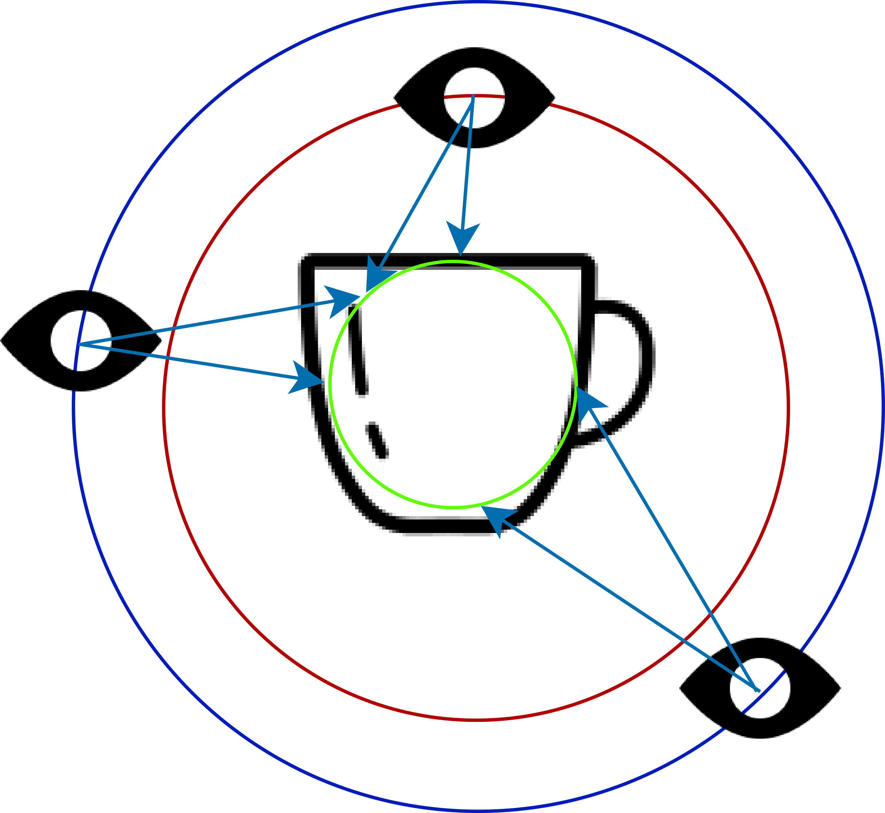

# mesh-tools
This repository contains tools for reconstructing, processing and evaluating point clouds and triangular surface meshes. 
The code is based on several scientific publications and makes heavy use of [CGAL](https://www.cgal.org/).


## Common interface for all tools

All tools have a couple of common command line parameters. To get a more complete and detailed list of all possible parameters use
the help command.

| Command                 | Description                                                                             |
|:------------------------|:----------------------------------------------------------------------------------------|
| `-h`    | Display a help message, explaining all command line options of the specific tool.       |
| `-w path/to/workingDir` | All input and output files are located inside the specified directory.                  |
| `-i inputFileName`      | The file name of the input for the tool. The file ending does not have to be specified. |
| `-o outputFileName`     | The file name of the output file(s). If left empty, the input file name is used.        |
| `-e exportOptions`      | Specify which files and which properties should be exported.                            |


## Available tools

### scan



Sample points on a surface mesh using a virtual scanning procedure, e.g. for [Deep Surface Reconstruction from Point Clouds with Visibility Information](https://github.com/raphaelsulzer/dsrv-data).
You can vary the number of scanned points and cameras, and add noise and outliers to the point cloud.

### omvs2npz

Extract points, normals and sensor positions from an [OpenMVS](https://github.com/cdcseacave/openMVS) project file and save them as arrays in a numpy `.npz` file.


### labatut

Reconstruct a 2-manifold surface mesh from a point cloud with visibility information using the algorithm presented in [Labatut et al. 2009](https://diglib.eg.org/handle/10.2312/CGF.v28i8pp2275-2290).

### feat

Extract features from a visibility augmented 3D Delaunay triangulation for [DGNN](https://github.com/raphaelsulzer/dgnn).
If a ground truth file is specified, ground truth occupancies for each cell of the 3D Delaunay triangulation will also be exported.


### occ2mesh

Transform a 3D Delaunay triangulation with cell occupancies as computed by `feat` or [DGNN](https://github.com/raphaelsulzer/dgnn) to a surface mesh.

### normal

Estimate (oriented) normals for a point cloud using different algorithms implemented in [CGAL](https://www.cgal.org/).

### sample

Sample points on a surface mesh.

### collapse

Apply the edge collapse algorithm implemented in [CGAL](https://www.cgal.org/) to simplify a triangle surface mesh.


## Dependencies

### Required
- [Boost](https://www.boost.org/) (>= v1.6.5, install with `sudo apt install libboost-all-dev`)
- [CGAL](https://www.cgal.org/) (>= v5.1.1)
- [ZLIB](https://zlib.net/) (for reading and writing `.npz` files, install with `sudo apt install zlib`)
- [xtensor](https://xtensor.readthedocs.io/en/latest/) (for reading and writing `.npz` files)
- [xtensor-io](https://xtensor-io.readthedocs.io/en/latest/) (for reading and writing `.npz` files)

### Optional
- [OpenMVS](https://github.com/cdcseacave/openMVS) (for loading point clouds from an OpenMVS project)
- [COLMAP](https://colmap.github.io/) (for loading point clouds from a COLMAP project) TODO: needs to be fixed
- [Open3D](http://www.open3d.org/) (for Marching Irregular Tetrahedra)


## Installation

```bash
git clone git@github.com:raphaelsulzer/mesh-tools.git
cd mesh-tools
mkdir build && cd build
cmake .. -DCMAKE_BUILD_TYPE=RELEASE -DTOOLX=ON
make -j
```
where TOOLX is the name of a tool listed above. 

